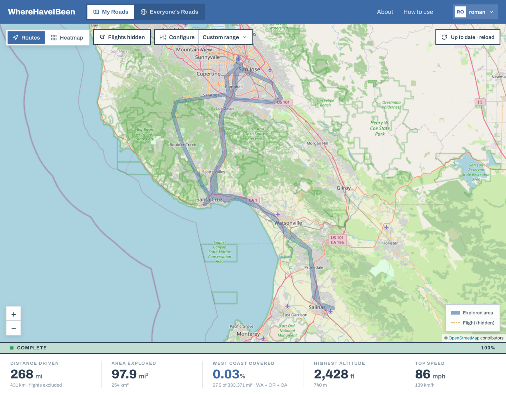
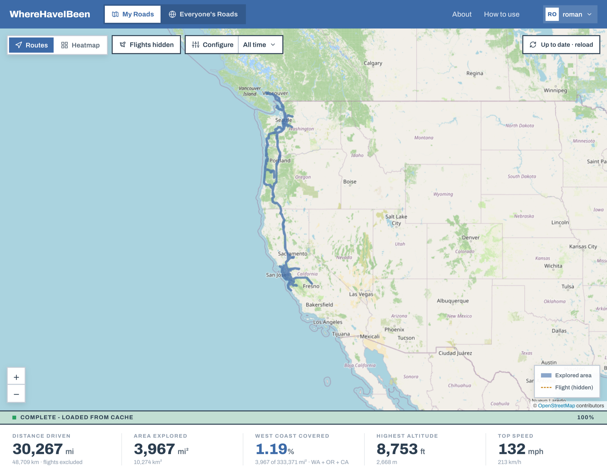
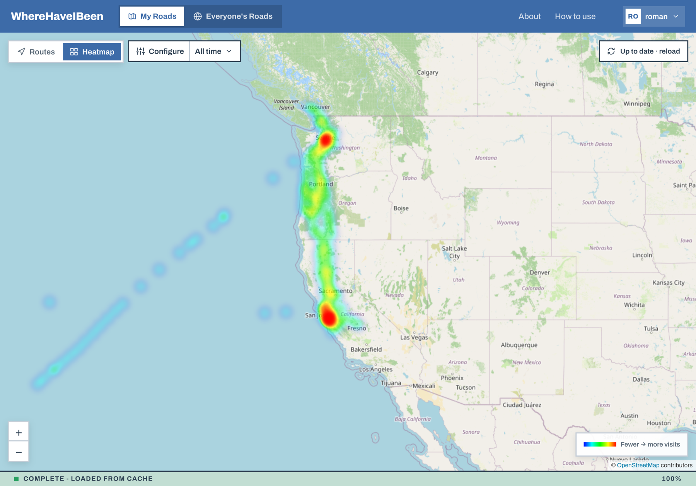
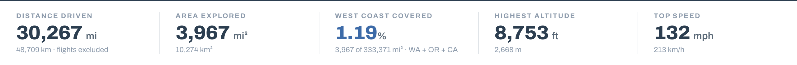
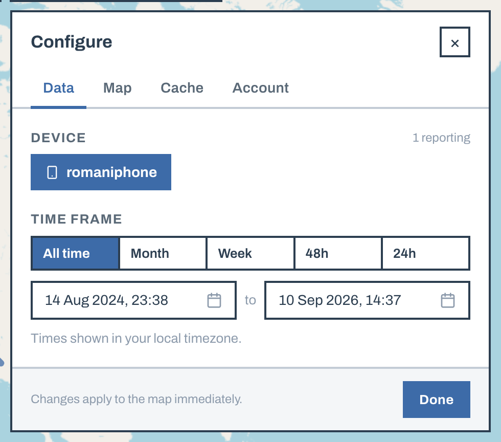
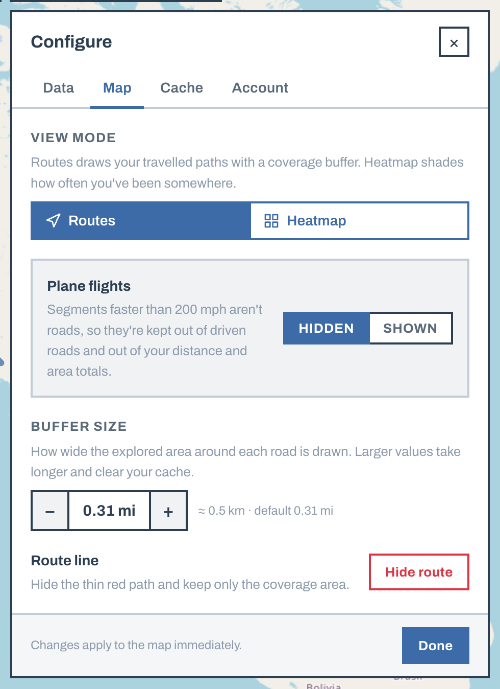

# WhereHaveIBeen
 Track the roads and areas you've visited on a map!

 Using OwnTracks to upload the location from your phone to an OwnTracks server, and displaying that data on a user-friendly website.

 ---
 ## Example Screenshots

### WhereHaveIBeen showing the area I travelled over a long weekend

 
 

### WhereHaveIBeen showing the roads I've travelled since beginning recording

 
 

### Heatmap mode shades how often you've been somewhere

---

## Ever heard of a little game called Forza Horizon?

I've always found the idea of a map that shows the places you've discovered fascinating. Forza Horizon implemented a map that had every road greyed out until you drove over it once. It encouraged you to drive every road in the entire game, exploring the map.

I've been looking for more excuses to get out and see things I haven't seen before, so I built WhereHaveIBeen to mark which areas of the "map" have already been discovered by me.

WhereHaveIBeen is a web app to display your OwnTracks location history. It joins each location update to the next and buffers the path into an explored area, so you can see where you've been without wasting your phone battery by uploading location every second.

---
## Extra Features

### Get stats on your OwnTracks data! Distance driven, area explored, how much of the west coast you've covered, highest altitude and top speed. Plane flights are detected and kept out of the driving totals.

 
 

### Choose what data to show! WhereHaveIBeen supports multiple OwnTracks users and devices, as well as filtering down by time frame.

 
 

### Adjust how the map is drawn: switch between routes and heatmap, show or hide flights, and change the buffer size around each road.

---
## What's on the way?
More settings! 

Hopefully a Google Maps Timeline import feature, as Timeline is changing to be local device only and will no longer be accessible online.

---
## Recently added!
**A new look.** Version 3.0 reworks the whole interface: the map fills the page, the filters and settings live in a single Configure popover, and the stats sit in a ribbon under the map with imperial units first and metric underneath.

**Heatmap mode.** Switch from Routes to Heatmap to shade how often you've been somewhere instead of drawing every path.

**Flight detection.** Plane trips are picked out of your GPS history automatically. They're drawn as a dashed line if you want them, and they're always kept out of your driven roads, distance, and area totals.

**Everyone's Roads.** A merged map of every user on the server, with your share of the total area explored.

**Accounts.** You can create an account straight from the home page, and the setup guide walks you through pointing the OwnTracks app at the server.

**TRMNL e-ink plugin.** Your last 30 days of driving as a road map with headline stats, rendered for the TRMNL 800×480 screen. See `trmnl/README.md`.

---
## Want to learn more?

Check out the "about" and "setup" pages of WhereHaveIBeen at:
[About WhereHaveIBeen](https://tracker.romangarms.com/about)
[How to Use WhereHaveIBeen](https://tracker.romangarms.com/how-to-use)
