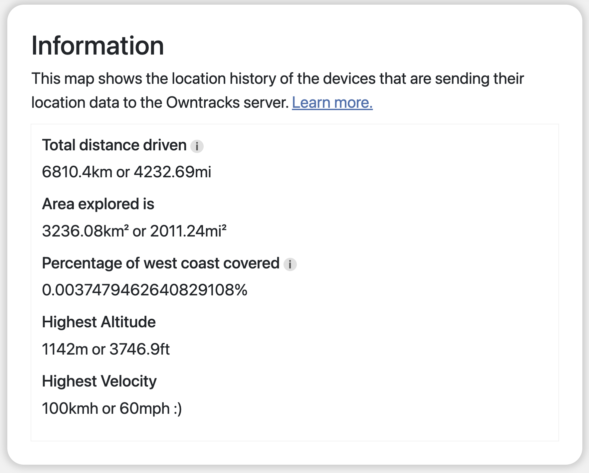

# WhereHaveIBeen
 Track the roads and areas you've visited on a map!

 Using OwnTracks to upload the location from your phone to an OwnTracks server, and displaying that data on a user-friendly website.

 ---
 ## Example Screenshots

### WhereHaveIBeen showing the roads I've travelled in the last week

 
 

### WhereHaveIBeen showing the roads I've travelled since beginning recording

---

## Ever heard of a little game called Forza Horizon?

I've always found the idea of a map that shows the places you've discovered fascinating. Forza Horizon implemented a map that had every road greyed out until you drove over it once. It encouraged you to drive every road in the entire game, exploring the map.

I've been looking for more excuses to get out and see things I haven't seen before, so I built WhereHaveIBeen to mark which areas of the "map" have already been discovered by me.

WhereHaveIBeen is a web app to display your OwnTracks location history while doing some extra processing to snap the routes between each location update to roads. This allows you to see the exact route you've taken, without wasting your phone battery by uploading location every second.

---
## Extra Features

### Get stats on your OwnTracks data! Show the total distance travelled, area explored, as well as highest altitude and velocity.

 
 

### Choose what data to show! WhereHaveIBeen supports multiple OwnTracks users and devices, as well as filtering down by time frame.

 
 

### Adjust how the map is drawn and change the routing URL if you host your own OSRM server.

---
## What's on the way?
More settings! 

Hopefully a Google Maps Timeline import feature, as Timeline is changing to be local device only and will no longer be accessible online.

---
## Recently added!
A better user settings system. Settings are no longer wiped on page refresh! You can change map buffer settings and the OSRM routing URL and WhereHaveIBeen will remmeber.

Currently I host an OSRM server with the data from Washington, Oregon, and California, but if you live elsewhere you can use your own. If you are unable to/unwilling to host your own, you can use the url for the public OSRM demo server.

---
## Want to learn more?

Check out the "about" and "setup" pages of WhereHaveIBeen at:
[About WhereHaveIBeen](https://tracker.romangarms.com/about)
[Setup WhereHaveIBeen](https://tracker.romangarms.com/setup)
